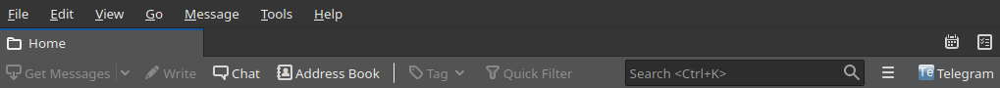
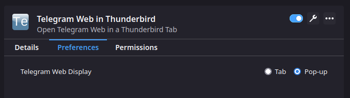
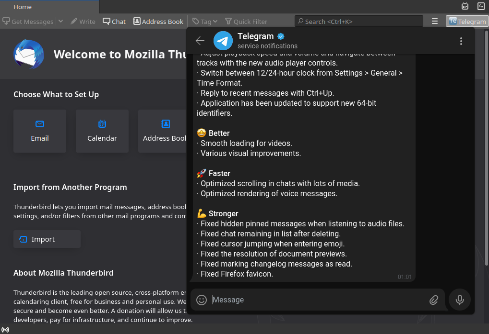

<p align="center"></p>

<h1>Telegram Web in Thunderbird</h1>
Telegram Web in Thunderbird is a Thunderbird add-on that opens Telegram Web in a Thunderbird tab.  

******************
<p align="center">
    <strong>Get it from<br>
    <a href="https://addons.thunderbird.net/fr/thunderbird/addon/telegram-web-in-thunderbird/">addons.thunderbird.net</a>
    </strong>
</p>

******************

<h2>How does it work ?</h2>
Once the add-on is installed, a new icon appears in Thunderbird Mail toolbar:


Click on it to open the Telegram Web tab.  

You can change add-on preferences to open Telegram Web in a pop-up rather than in a tab:  


In that case, the pop-up would look like this:  


<h3>What permissions are needed ?</h3>
Telegram Web in Thunderbird will need to access Thunderbird tabs to maintain a unique tab.

<h3>Does Telegram Web in Thunderbird collects my data ?</h3>
No, Telegram Web in Thunderbird simply opens tabs in Thunderbird, exactly as it would be done in a web browser.  
It does not collect any data.  

Of course, Telegram Web works as it would do in your web browser, including regarding their own data collection.  

<h3>So Telegram Web in Thunderbird will never collect my data ?</h3>
Never.  

<h3>How do I stay connected when I re-open Thunderbird ?</h3>
If you wish to stay connected to Telegram Web, you will have to allow cookies.  

The cookies menu can be access as follows in Thunderbird:    
_GNU/Linux_ : "Edit" > "Preferences" > "Privacy" or "Privacy and Security" > "Web Content" section.  
_macOS_ : "Thunderbird" > "Preferences" > "Privacy" or "Privacy and Security" > "Web Content" section.  
_Windows_ : "Tools" > "Options" > "Privacy" or "Privacy and Security" > "Web Content" section.  

You will have to allow and keep cookies for this domain:  
* https://web.telegram.org

<h2>Build from source</h2>
Prerequisite:  
Install <a href="(https://nodejs.org">Node.js</a>.  

Building the add-on from source requires to have a working [Node.js](https://nodejs.org). In addition, some package.json scripts would work only in a "*nix" environment. The add-on can be built by running the following command from its root directory:  
```
npm ci
npm run build
```

<h2>Legal notice</h2>

Thunderbird is a registered trademark of the Mozilla Foundation.  
Telegram is a registered trademark of TELEGRAM FZ-LLC.  
GNU is a registered trademark of the Free Software Foundation.  
Linux is a registered trademark of Linus Torvalds.  
Windows is a registered trademark of Microsoft Corporation.  
macOS is a registered trademark of Apple Inc.  

The above-mentioned trademarks are only used to refer to products.  
Telegram Web in Thunderbird and its developer are not affiliated, sponsored nor endorsed by any of the above-mentioned organizations.  

<h2>Changelog</h2>
3.1.0 -> add spaces toolbar icon for Thunderbird >= 100  

3.0.2 -> update to web-ext 7.1.0 and typescript 4.7.4, override indirect dev dependency to fix security issue  

3.0.1 -> override indirect dev dependency to fix security issue

3.0.0 -> update to web-ext 6.8.0 and typescript 4.6.3, add context menu on browser action icon on Thunderbird 91+    

2.0.1 -> update to web-ext 6.6.0 and typescript 4.5.5  

2.0.0 -> re-structured code, add possibility to open Telegram web in browser action popup  

1.2.0 -> updated web-ext and typescript versions, workaround for https://bugzilla.mozilla.org/show_bug.cgi?id=1728631, npm script refreshed  

1.1.0 -> updated web-ext and typescript versions, icons from SVG to PNG   

1.0.0 -> first release  
